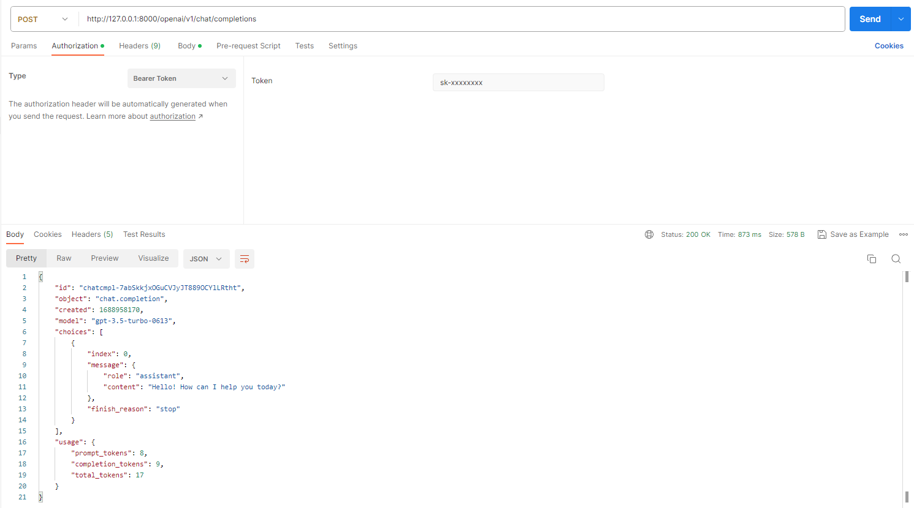
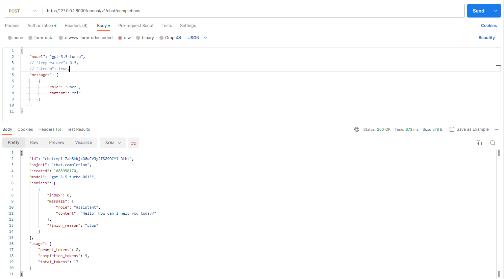

# OpenAI Proxy

Super simple implementation of OpenAI API and Azure GPT API proxy forwarding based on FastAPI and httpx.


## Get start

### 1. Install dependencies

```shell
pip install -r requirments.txt
```

### 2. Run server

```shell
python -m uvicorn app:app
```

## Usage

### 1. OpenAI 





### 2. Azure GPT


# Credit

This project is a simplified version
of [beidongjiedeguang/openai-forward](https://github.com/beidongjiedeguang/openai-forward).